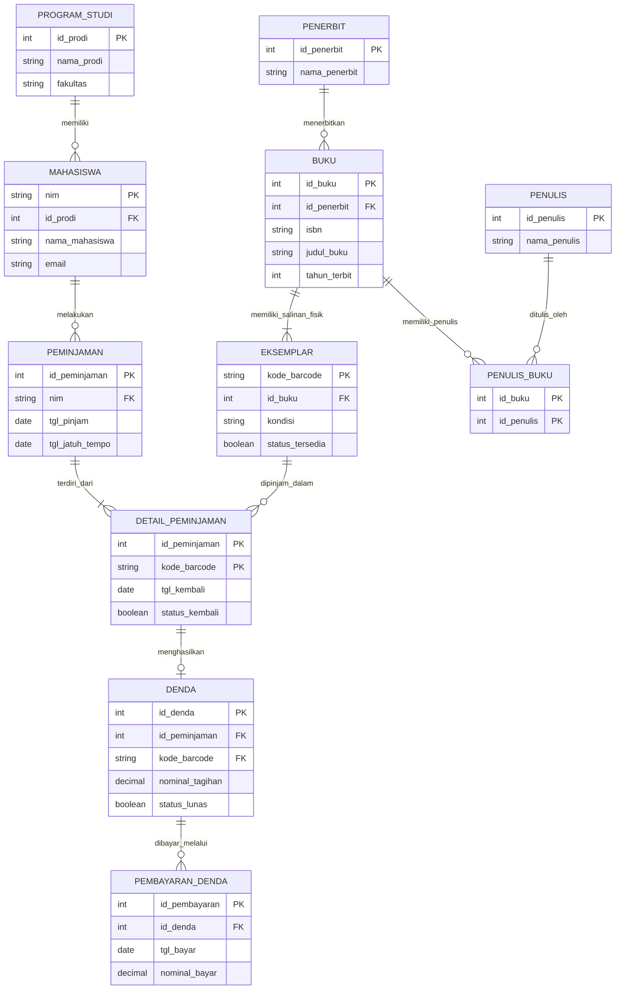

# Perancangan Basis Data E-Library Kampus (Normalisasi 3NF)

---

## 1. Pendahuluan & Skenario Sistem

### 1.1 Skenario Sistem E-Library Kampus
Sistem **E-Library Kampus** dirancang untuk mengelola seluruh operasional perpustakaan perguruan tinggi secara terintegrasi dan persisten. Sistem ini mencakup pemrosesan data entitas utama dan operasional harian:
* **Anggota & Akademik:** Pencatatan data mahasiswa beserta program studi dan fakultas pengampu.
* **Katalog Metadata & Penulis:** Pengelolaan informasi judul buku, nomor ISBN, penerbit, serta relasi multi-penulis (*multi-author*).
* **Inventaris Fisik (Eksemplar):** Pelacakan fisik salinan buku di rak perpustakaan menggunakan kode *barcode* unik, kondisi fisik, dan status ketersediaan.
* **Sirkulasi Peminjaman:** Pencatatan transaksi peminjaman, batas jatuh tempo, dan tanggal pengembalian.
* **Audit Keuangan & Denda:** Perhitungan denda keterlambatan pengembalian buku dan histori pembayaran denda secara akuntabel.

### 1.2 Posisi Modul & Tujuan Pemodelan Data
Sesuai dengan kurikulum Pemrograman Website, pemodelan data pada Modul 06 diletakkan sebelum pengenalan sintaksis SQL (Modul 07) untuk memastikan skema basis data bersih, ternormalisasi, dan bebas anomali sebelum dimanipulasi di sisi *back-end* (Modul 13 & 14).

---

## 2. Landasan Teori Basis Data Relasional

### 2.1 Konsep Model Relasional
Dikonseptualisasikan oleh Edgar F. Codd pada tahun 1970, model relasional menyajikan data sebagai kumpulan tabel dua dimensi yang saling terhubung (*relations*).
* **Relation (Tabel):** Struktur dua dimensi tempat data disimpan.
* **Tuple (Record/Baris):** Baris data tunggal yang mewakili satu instans entitas.
* **Attribute (Field/Kolom):** Kolom yang menyimpan satu jenis karakteristik/nilai data.

### 2.2 Properti Transaksional ACID
Setiap pemrosesan transaksi pada RDBMS (seperti MySQL/PostgreSQL) dijamin oleh empat prinsip ACID:
1. **Atomicity:** Seluruh rangkaian operasi transaksi berhasil dieksekusi secara utuh, atau dibatalkan total (*rollback*) jika terjadi kegagalan.
2. **Consistency:** Transaksi hanya memindahkan basis data dari satu keadaan valid ke keadaan valid lainnya tanpa melanggar aturan integritas (*constraints*).
3. **Isolation:** Transaksi konkuren yang berjalan bersamaan tidak saling mengganggu sebelum perubahan berkomitmen (*commit*).
4. **Durability:** Setelah *commit*, perubahan data disimpan secara permanen di media penyimpanan fisik dan bertahan dari *server crash*.

### 2.3 Jenis Kunci & Integritas Referensial
* **Primary Key (PK):** Pengenal unik untuk setiap baris data (tidak boleh `NULL` dan tidak boleh duplikat).
* **Foreign Key (FK):** Kolom yang merujuk pada *Primary Key* di tabel induk untuk menegakkan hubungan antar-tabel dan operasi `JOIN`.
* **Composite Key:** Kunci utama yang dibentuk dari kombinasi dua kolom atau lebih (digunakan pada tabel penghubung/junction).

**Aturan Integritas Referensial:**
* `CASCADE`: Perubahan/penghapusan data pada tabel induk otomatis diterapkan pada tabel anak.
* `RESTRICT` / `NO ACTION`: Menolak penghapusan/pembaruan pada tabel induk selama data anak masih ada.
* `SET NULL`: Mengisi kolom *Foreign Key* tabel anak dengan nilai `NULL` jika data induk dihapus.

### 2.4 Anomali Data & Standardisasi Penamaan
Normalisasi bertujuan mencegah tiga jenis anomali data:
1. **Anomali Sisipan (Insert Anomaly):** Ketidakmampuan memasukkan data baru karena ketergantungan data lain yang belum ada.
2. **Anomali Hapus (Delete Anomaly):** Kehilangan data penting secara tidak sengaja saat menghapus baris lain.
3. **Anomali Pembaruan (Update Anomaly):** Ketidakkonsistenan data akibat pembaruan data duplikat tidak dilakukan di semua tempat.

**Aturan Standardisasi Penamaan:**
* **Casing:** Huruf kecil seluruhnya dengan pemisah garis bawah (`snake_case`).
* **Pluralisasi:** Kata benda tunggal (*singular noun*) untuk nama tabel (contoh: `mahasiswa`, `buku`).
* **Kunci Relasional:** Penamaan kolom *Foreign Key* disamakan persis dengan nama *Primary Key* rujuakannya.

---

## 3. Simulasi Normalisasi Bertahap (UNF hingga 3NF)

### 3.1 Unnormalized Form (UNF)
Seluruh data mahasiswa, transaksi, katalog buku, dan penulis digabungkan dalam satu tabel tunggal dengan kelompok data berulang (*repeating groups*) pada sel buku yang dipinjam.

`Tabel_Peminjaman_UNF(NIM, Nama_Mhs, Email, Prodi, Fakultas, {Kode_Barcode, ISBN, Judul_Buku, Nama_Penerbit, {Nama_Penulis}, Tgl_Pinjam, Tgl_Jatuh_Tempo, Tgl_Kembali, Denda, Status_Lunas})`

### 3.2 First Normal Form (1NF)
Menghilangkan kelompok data berulang (*repeating groups*) sehingga setiap sel hanya berisi satu nilai atomik tunggal. Kunci utama berbentuk kunci komposit.

* **Primary Key (Composite):** `(NIM, Kode_Barcode, Tgl_Pinjam)`
* **Atribut:** `NIM`, `Nama_Mhs`, `Email`, `Prodi`, `Fakultas`, `Kode_Barcode`, `ISBN`, `Judul_Buku`, `Nama_Penerbit`, `Nama_Penulis`, `Tgl_Pinjam`, `Tgl_Jatuh_Tempo`, `Tgl_Kembali`, `Denda`, `Status_Lunas`
* *Masalah 1NF:* Terjadi redundansi data mahasiswa dan metadata buku di setiap baris transaksi.

### 3.3 Second Normal Form (2NF)
Memenuhi syarat 1NF dan memisahkan ketergantungan parsial (*partial dependency*) pada kunci komposit:
1. **Tabel Mahasiswa:** `NIM` (PK), `Nama_Mhs`, `Email`, `Prodi`, `Fakultas`
2. **Tabel Buku & Penerbit:** `ISBN` (PK), `Judul_Buku`, `Nama_Penerbit`, `Nama_Penulis`
3. **Tabel Eksemplar Fisik:** `Kode_Barcode` (PK), `ISBN`
4. **Tabel Peminjaman:** `ID_Peminjaman` (PK), `NIM`, `Tgl_Pinjam`, `Tgl_Jatuh_Tempo`
5. **Tabel Detail Peminjaman:** `(ID_Peminjaman, Kode_Barcode)` (Composite PK), `Tgl_Kembali`, `Denda`
* *Masalah 2NF:* Masih terdapat ketergantungan transitif (`Prodi` -> `Fakultas`, `Nama_Penerbit` -> `Buku`).

### 3.4 Third Normal Form (3NF)
Memenuhi syarat 2NF dan menghilangkan seluruh ketergantungan transitif (*transitive dependency*). Seluruh atribut bukan kunci bergantung langsung hanya pada kunci utama.

---

## 4. Spesifikasi Skema Tabel Akhir (3NF Lengkap)

### 4.1 Modul Master & Referensi

#### Tabel `program_studi`
| Nama Kolom | Tipe Data | Keterangan / Constraint |
| :--- | :--- | :--- |
| `id_prodi` | `INT` | **PK**, AUTO_INCREMENT |
| `nama_prodi` | `VARCHAR(100)` | NOT NULL, UNIQUE |
| `fakultas` | `VARCHAR(100)` | NOT NULL |

#### Tabel `mahasiswa`
| Nama Kolom | Tipe Data | Keterangan / Constraint |
| :--- | :--- | :--- |
| `nim` | `VARCHAR(15)` | **PK** |
| `id_prodi` | `INT` | **FK** -> `program_studi.id_prodi` |
| `nama_mahasiswa` | `VARCHAR(100)` | NOT NULL |
| `email` | `VARCHAR(100)` | NOT NULL, UNIQUE |

#### Tabel `penulis`
| Nama Kolom | Tipe Data | Keterangan / Constraint |
| :--- | :--- | :--- |
| `id_penulis` | `INT` | **PK**, AUTO_INCREMENT |
| `nama_penulis` | `VARCHAR(100)` | NOT NULL |

#### Tabel `penerbit`
| Nama Kolom | Tipe Data | Keterangan / Constraint |
| :--- | :--- | :--- |
| `id_penerbit` | `INT` | **PK**, AUTO_INCREMENT |
| `nama_penerbit` | `VARCHAR(100)` | NOT NULL |

---

### 4.2 Modul Katalog & Inventaris

#### Tabel `buku` (Katalog Metadata)
| Nama Kolom | Tipe Data | Keterangan / Constraint |
| :--- | :--- | :--- |
| `id_buku` | `INT` | **PK**, AUTO_INCREMENT |
| `id_penerbit` | `INT` | **FK** -> `penerbit.id_penerbit` |
| `isbn` | `VARCHAR(20)` | NOT NULL, UNIQUE |
| `judul_buku` | `VARCHAR(200)` | NOT NULL |
| `tahun_terbit` | `YEAR` | NOT NULL |

#### Tabel `penulis_buku` (Junction Table Multi-Penulis)
| Nama Kolom | Tipe Data | Keterangan / Constraint |
| :--- | :--- | :--- |
| `id_buku` | `INT` | **PK Composite**, **FK** -> `buku.id_buku` |
| `id_penulis` | `INT` | **PK Composite**, **FK** -> `penulis.id_penulis` |

#### Tabel `eksemplar` (Inventaris Fisik)
| Nama Kolom | Tipe Data | Keterangan / Constraint |
| :--- | :--- | :--- |
| `kode_barcode` | `VARCHAR(50)` | **PK** (Identifier fisik unik) |
| `id_buku` | `INT` | **FK** -> `buku.id_buku` |
| `kondisi` | `ENUM('Baik', 'Rusak')` | DEFAULT 'Baik' |
| `status_tersedia` | `BOOLEAN` | DEFAULT TRUE |

---

### 4.3 Modul Transaksional & Jejak Audit Keuangan

#### Tabel `peminjaman` (Header Transaksi)
| Nama Kolom | Tipe Data | Keterangan / Constraint |
| :--- | :--- | :--- |
| `id_peminjaman` | `INT` | **PK**, AUTO_INCREMENT |
| `nim` | `VARCHAR(15)` | **FK** -> `mahasiswa.nim` |
| `tgl_pinjam` | `DATE` | NOT NULL |
| `tgl_jatuh_tempo` | `DATE` | NOT NULL |

#### Tabel `detail_peminjaman` (Rincian Item Peminjaman)
| Nama Kolom | Tipe Data | Keterangan / Constraint |
| :--- | :--- | :--- |
| `id_peminjaman` | `INT` | **PK Composite**, **FK** -> `peminjaman.id_peminjaman` |
| `kode_barcode` | `VARCHAR(50)` | **PK Composite**, **FK** -> `eksemplar.kode_barcode` |
| `tgl_kembali` | `DATE` | NULL |
| `status_kembali` | `BOOLEAN` | DEFAULT FALSE |

#### Tabel `denda` (Tagihan Keuangan)
| Nama Kolom | Tipe Data | Keterangan / Constraint |
| :--- | :--- | :--- |
| `id_denda` | `INT` | **PK**, AUTO_INCREMENT |
| `id_peminjaman` | `INT` | **FK** -> `detail_peminjaman.id_peminjaman` |
| `kode_barcode` | `VARCHAR(50)` | **FK** -> `detail_peminjaman.kode_barcode` |
| `nominal_tagihan` | `DECIMAL(10,2)` | NOT NULL |
| `status_lunas` | `BOOLEAN` | DEFAULT FALSE |

#### Tabel `pembayaran_denda` (Histori Pembayaran)
| Nama Kolom | Tipe Data | Keterangan / Constraint |
| :--- | :--- | :--- |
| `id_pembayaran` | `INT` | **PK**, AUTO_INCREMENT |
| `id_denda` | `INT` | **FK** -> `denda.id_denda` |
| `tgl_bayar` | `DATE` | NOT NULL |
| `nominal_bayar` | `DECIMAL(10,2)` | NOT NULL |

---

## 5. Diagram Relasi Entitas (Mermaid ERD)

